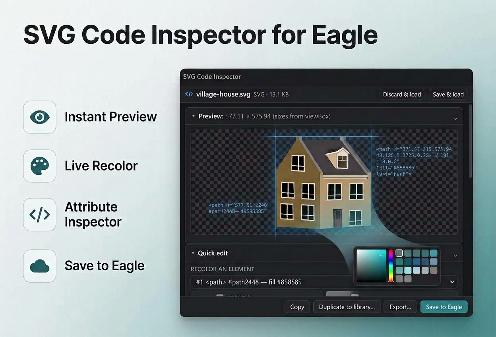
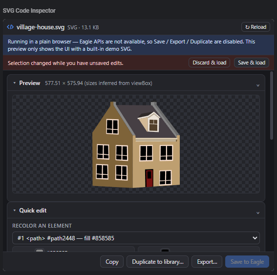
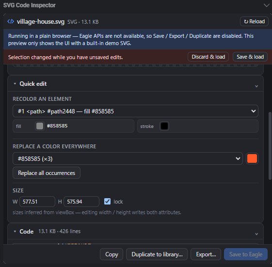
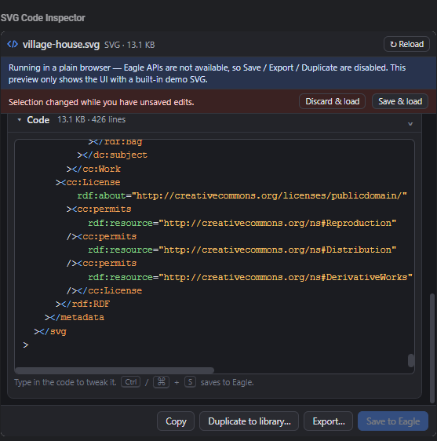

# SVG Code Inspector — Eagle plugin

An **inspector plugin** for [Eagle](https://eagle.cool) (4.0 Beta 17+) that shows the raw SVG
source of the selected `.svg` item with syntax highlighting, a live preview, and quick,
non-destructive edits — recoloring, size adjustment — that you can save straight back into
Eagle.

Select an SVG in your library and the inspector panel appears on the right with three
sections: **Preview**, **Quick edit**, and **Code**.

<p align="center">
  
</p>

## Screenshots

<p align="center">
  
</p>

<p align="center">
  
</p>

<p align="center">
  
</p>

---

The plugin follows Eagle's standard project layout — `manifest.json` lives at the repository
root, exactly like Eagle's own "Create Plugin" templates and the
[eagle-app/eagle-plugin-examples](https://github.com/eagle-app/eagle-plugin-examples) repos:

```
svg-code-inspector/            ← the plugin itself (this repository root)
├─ manifest.json               ← plugin manifest (type: inspector for .svg)
├─ logo.png                    ← 128×128 icon
├─ index.html                  ← panel shell
├─ style.css                   ← panel + syntax-highlighting styles (Eagle themes)
├─ js/
│  └─ plugin.js                ← all logic (no build step, no dependencies)
├─ README.md
├─ tools/                      ← dev-only helpers (never packaged)
│  ├─ gen-logo.js              ← regenerates logo.png (pure Node, no deps)
│  └─ smoke-test.cjs           ← headless tests: node tools/smoke-test.cjs
└─ dist/                       ← dev-only build output (never packaged)
   └─ SVG-Code-Inspector.eagleplugin   ← packaged build for double-click install
```

---

## Features

| Feature | Details |
| --- | --- |
| **Preview** | Live render of the current code on a checkerboard background (updated as you type). |
| **Code viewer/editor** | Syntax-highlighted XML with tags, attribute names, values and comments colored. The code view is a real textarea — click and type. `Tab` inserts two spaces, `Ctrl/Cmd + S` saves. |
| **Recolor an element** | Pick a shape from the list (each entry shows its `fill`/`stroke`), then change its fill or stroke via a colour picker or a raw-value field (`#hex`, `none`, `rgb(...)`, `url(#id)`, …). |
| **Replace a color everywhere** | The palette dropdown lists every hex colour used in the file with occurrence counts; pick one, choose a new colour, and replace all of its uses in one click (both `fill="#…"` attributes and `style="fill: …"` declarations). `url(#fragment)` references are never touched. |
| **Size** | Change the `<svg>` width/height numerically. Units are preserved (`12pt` → `640pt`); missing attributes are inserted; the lock keeps the aspect ratio (from width/height or `viewBox`). |
| **Save to Eagle** | Writes the edited SVG to a temp file and swaps it in with the officially recommended `item.replaceFile()`, which refreshes the thumbnail automatically. |
| **Duplicate to library…** | Imports the edited SVG as a new Eagle item — the original stays untouched. |
| **Export…** | Native save dialog → writes the edited SVG anywhere on disk. |
| **Copy** | Copy the whole code to the clipboard. |
| **Theme aware** | Follows Eagle's LIGHT / LIGHTGRAY / GRAY / BLUE / PURPLE / DARK themes. |
| **Collapsible sections** | Preview / Quick edit / Code sections fold to keep the panel compact. |

Edits are made as **raw text edits** (offset-precise, element-scoped), so the rest of your
file — formatting, comments, entities — is preserved byte-for-byte.

---

## Install

### Option A — packaged plugin (easiest)

1. Take `dist/SVG-Code-Inspector.eagleplugin` (or build your own, see *Packaging*).
2. Double-click it — Eagle installs the plugin.
3. Select any `.svg` item; the **SVG Code Inspector** panel appears in the inspector area.
   If it is not visible, open the inspector flyout and enable it.

### Option B — manual developer install

1. In Eagle, open **Plugins** → **Developer Options** → **Create Plugin**, pick the
   **Inspector Plugin** type, and choose a location. Eagle creates a folder with a
   `manifest.json` and `index.html`.
2. Replace that folder's contents with the plugin files from this repository root
   (`manifest.json`, `logo.png`, `index.html`, `style.css`, and the `js/` folder with
   `plugin.js`).
3. Select an SVG in your library — the inspector loads. Right-click the inspector panel and
   choose **Developer Tools** to debug; `devTools: true` is already set in `manifest.json`.

> Requirement: **Eagle 4.0 Beta 17 or newer** (inspector plugins).
> Official docs: [Plugin types — Inspector](https://developer.eagle.cool/plugin-api/get-started/plugin-types/inspector.md)

---

## Using it

1. Select an `.svg` item in Eagle. If Eagle is showing the inspector already, switching
   selection auto-loads the new file (the panel polls the selection; unsaved edits trigger a
   *Discard & load* / *Save & load* bar instead of silently wiping your work).
2. **Preview** shows the artwork. **Code** shows the source.
3. Quick edits:
   - **Recolor an element** — choose an element, use the colour swatches or type a value and
     press Enter. Elements without their own `fill`/`stroke` are excluded from the list
     (they inherit); values that come from `style="fill: …"` are edited there, in place.
   - **Replace a color everywhere** — choose the old colour, pick the new one, click replace.
   - **Size** — edit W/H (Enter or blur applies). When both dimensions exist the lock keeps
     the aspect ratio.
4. Any of the above marks the file as *edited*; **Save to Eagle** commits it as the item's
   real file. For experiments, use **Duplicate to library…** or **Export…** instead — the
   original is preserved.

## Safety notes

- **Save to Eagle replaces the item's actual file.** Eagle's recommended flow is used (temp
  file → `item.replaceFile()`), but treat it like any overwrite: use *Duplicate* / *Export*
  when you are not sure.
- If you type malformed XML, the quick-edit tools disable with a message; the code editor
  stays usable so you can fix it. The preview simply shows the previous renderable state.

## Known limitations

- The palette and the per-element colour swatches work with **hex colours**. Other paints
  (`currentColor`, `rgb()`, CSS variables…) remain editable via the raw-value text fields
  and the code editor.
- Elements whose paint is inherited (no own `fill`/`stroke` attribute or style) are not
  listed in the recolor dropdown.
- Only files whose extension is `svg` trigger the inspector.
- Very large files re-highlight on a short debounce; editing stays usable but re-rendering
  can lag on multi-megabyte SVGs.
- The SVG is re-rendered from text, so externally-referenced images/fonts resolve relative
  to nothing — embedded content only.

## Packaging & publishing

**In Eagle:** Plugins panel → right-click the plugin → *Pack Plugin* → `.eagleplugin`.

**Manually:** zip only the five plugin files from this repository root (so `manifest.json`
sits at the archive root) and rename the file to `SVG-Code-Inspector.eagleplugin`:

```powershell
Compress-Archive -Path .\manifest.json, .\logo.png, .\index.html, .\style.css, .\js\plugin.js `
                 -DestinationPath .\dist\SVG-Code-Inspector.eagleplugin
```

`tools/`, `dist/` and `README.md` are development artifacts and must not be packed.

Before submitting anywhere:

- Keep the `id` in `manifest.json` unique to you (it is a UUID — generate a new one for your
  own release).
- Set `"devTools": false` for production builds.
- Read the [packaging](https://developer.eagle.cool/plugin-api/publishing/package.md) and
  [prepare/checklist](https://developer.eagle.cool/plugin-api/publishing/prepare.md) guides.

## How it works under the hood

- The manifest registers an inspector for `svg`:

  ```json
  {
      "preview": { "svg": { "inspector": { "path": "index.html", "height": 460, "multiSelect": false } } }
  }
  ```

- The panel uses `eagle.onPluginCreate`, `eagle.app.theme`, `eagle.onThemeChanged` and
  `eagle.item.getSelected()` ([item API](https://developer.eagle.cool/plugin-api/api/item.md)).
- The file is read with Node's `fs` (`item.filePath`), parsed with `DOMParser` for metadata
  and DOM-order element lists, while all edits are applied as text operations inside the
  original source using a quote-aware XML tokenizer — no reformatting, no data loss.
- Saving follows the documented best practice: write the new version to a temp file, then
  `item.replaceFile(tmpPath)`, which replaces the original and refreshes the thumbnail
  ([item docs](https://developer.eagle.cool/plugin-api/api/item.md#replacefilefilepath)).
- In a plain browser the plugin boots in *standalone demo mode* (a built-in demo SVG) so you
  can preview the UI by opening `index.html` directly — Eagle APIs are disabled there.

## Troubleshooting

| Problem | Fix |
| --- | --- |
| Panel doesn't appear for an SVG | Eagle version must be ≥ 4.0 Beta 17; confirm the item's extension is `svg`; enable the plugin in the inspector flyout. |
| DevTools won't open | `manifest.json` needs `"devTools": true` (already set) and the plugin must have been re-installed after the change. |
| Save/Export greyed out | The panel is running in standalone demo mode (opened in a browser). Use it inside Eagle. |
| Error reading the file | The library item's file was moved/deleted; use Reload after restoring it. |

## Docs referenced

- [Eagle plugin docs](https://developer.eagle.cool/plugin-api/get-started/readme.md)
- [Inspector plugins](https://developer.eagle.cool/plugin-api/get-started/plugin-types/inspector.md)
- [manifest.json reference](https://developer.eagle.cool/plugin-api/tutorial/manifest.md)
- [Item API](https://developer.eagle.cool/plugin-api/api/item.md)
- [Accessing local files](https://developer.eagle.cool/plugin-api/tutorial/access-local-files.md)
- [Packaging](https://developer.eagle.cool/plugin-api/publishing/package.md)
